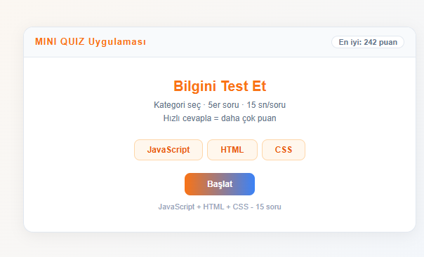
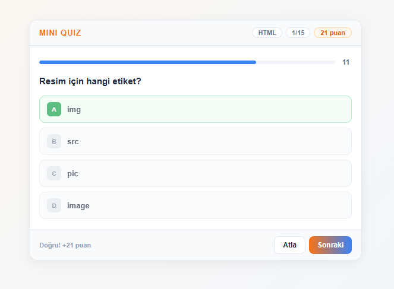
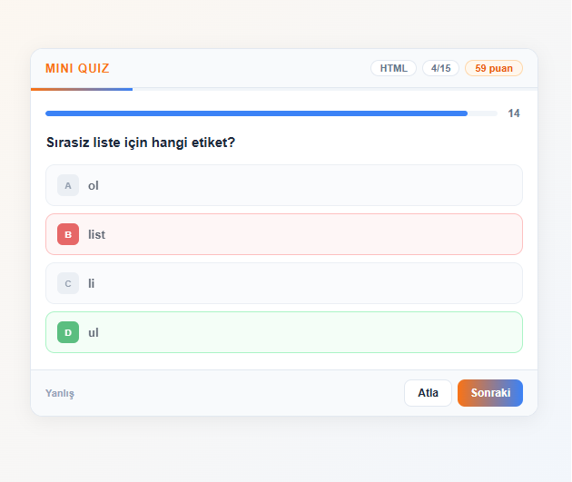
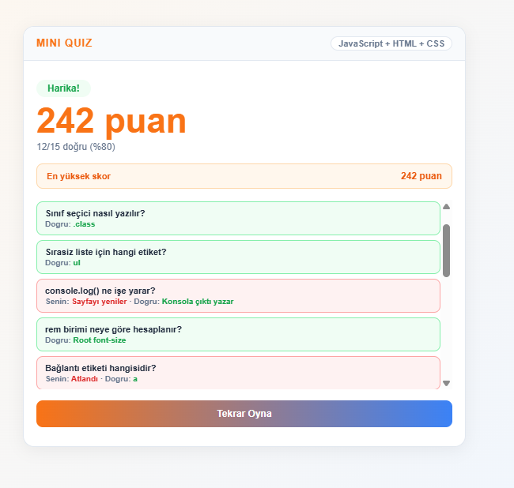

# 🎯 WebCraft Mini Quiz

JavaScript, HTML ve CSS bilgilerini test eden interaktif bir quiz uygulaması.

---

## 🚀 Canlı Demo

👉 [WebCraft Mini Quiz'i oyna](https://symkllci.github.io/WebCraft-MiniQuiz)
---

## 📸 Önizleme

---

## ✨ Özellikler

- 📁 **3 Kategori** — JavaScript, HTML, CSS ayrı ayrı seçilebiliyor
- ⏱️ **15 saniyelik geri sayım** — her soru için ayrı timer
- ⚡ **Hız bonusu** — ne kadar hızlı cevaplarsan o kadar çok puan
- 🔀 **Sorular karışıyor** — her oyunda farklı sıra
- 🏆 **Highscore** — en iyi skor tarayıcıda saklanıyor
- 📊 **Sonuç özeti** — hangi soruyu doğru/yanlış yaptığını gösteriyor

---

## 🛠️ Kullanılan Teknolojiler

- HTML5
- CSS3
- Vanilla JavaScript
- localStorage

---

## 📁 Kurulum

index.html dosyasını tarayıcıda aç, başka bir şey gerekmiyor.

---

## 👨‍💻 Geliştirici

**Adın Soyadın** — WebCraft Projesi 2025
